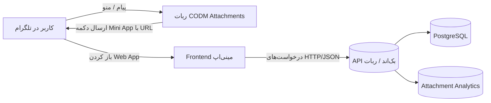
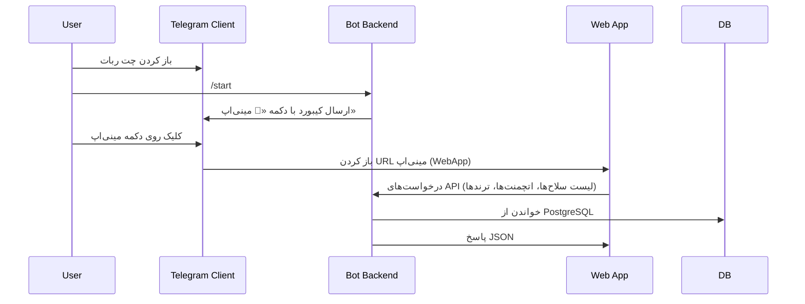

# معماری مینی‌اپ تلگرام CODM Attachments

این سند معماری کلی سیستم را با تمرکز بر مینی‌اپ تلگرام توضیح می‌دهد و نشان می‌دهد مینی‌اپ چگونه روی معماری موجود ربات سوار می‌شود.

---

## ۱. نمای کلی سیستم

سیستم از چند لایه اصلی تشکیل شده است:

- **کلاینت تلگرام**
  - کاربر ربات را استارت می‌کند و روی «مینی‌اپ» کلیک می‌کند.
  - مینی‌اپ به‌صورت Web App داخل خود تلگرام باز می‌شود.

- **Frontend مینی‌اپ (Web App)**
  - یک برنامه وب (SPA یا صفحات ساده) که داخل WebView تلگرام اجرا می‌شود.
  - از طریق HTTP/JSON با API بک‌اند صحبت می‌کند.

- **Bot Backend (ربات فعلی)**
  - مبتنی بر `python-telegram-bot` و معماری ماژولار.
  - مدیریت منوها، deep-link ها، احراز هویت `initData` مینی‌اپ و ارسال لینک مینی‌اپ.

- **لایه داده و منطق کسب‌وکار**
  - `DatabaseAdapter` و پیاده‌سازی PostgreSQL (`DatabasePostgresProxy`).
  - ماژول‌های آنالیتیکس (`AttachmentAnalytics`, `AnalyticsPostgres`).

- **دیتابیس PostgreSQL**
  - ذخیره سلاح‌ها، اتچمنت‌ها، آمار استفاده، کاربران، کانال‌ها و ...

### ۱.۱. دیاگرام سطح بالا

- در عمل، **Bot Backend و API بک‌اند** می‌توانند یک سرویس واحد باشند (پروسه پایتون فعلی) یا دو سرویس جدا (مثلاً FastAPI در کنار ربات).

---

## ۲. معماری فعلی ربات (زیرساخت مشترک)

### ۲.۱. لایه ورود و Application

- فایل اصلی: `main.py`
  - ساخت شیء اصلی bot (مثلاً `CODMAttachmentsBot`).
  - ایجاد `Application` تلگرام و راه‌اندازی polling.

- کلاس کارخانه:
  - `app/factory.py` → کلاس `BotApplicationFactory`
    - `create_application()` → ساخت Application و تنظیم `bot_data`.
    - `setup_handlers()` → ثبت handler ها از طریق registries.

### ۲.۲. لایه هندلرها (Handlers Layer)

- Registryها:
  - `app/registry/UserHandlerRegistry`، `AdminHandlerRegistry`، `InlineHandlerRegistry` و ...
- هندلرهای کاربر:
  - مسیر: `handlers/user/modules/`
  - مثال مهم:
    - `navigation/main_menu.py` → کلاس `MainMenuHandler` و متد `start`
      - ساخت کیبورد اصلی (reply keyboard).
      - استفاده از `kb(...)` و `t(...)` برای متن‌های چندزبانه.
- این لایه در آینده نقطه‌ی اصلی **اضافه کردن دکمه Mini App** خواهد بود.

### ۲.۳. لایه دیتابیس و کش

- Adapter مرکزی:
  - `core/database/database_adapter.DatabaseAdapter`
  - استفاده از الگوی **Adapter** و **Proxy** برای اتصال به PostgreSQL.
  - متدهای کلیدی برای مینی‌اپ:
    - `get_weapons_in_category`, `get_all_attachments`, `get_top_attachments`,
      `get_season_top_attachments`, `get_attachment_by_id`, `search_attachments_fts`.
- پیاده‌سازی PostgreSQL:
  - `core/database/database_pg_proxy.DatabasePostgresProxy`
  - حاوی SQL واقعی روی جداول `weapons`, `attachments`, `user_attachment_engagement` و ...
- کش:
  - از طریق `core/cache/cache_manager` برای برخی متدها (مثلاً شمارش دسته‌ها).

### ۲.۴. لایه آنالیتیکس

- **AttachmentAnalytics** (`utils/attachment_analytics.py`)
  - ردیابی view/click/share/copy و rating.
  - ذخیره رویدادها در جدول `attachment_metrics` و تجمیع در `attachment_performance`.
  - تولید لیست‌های:
    - Trending Attachments (`get_trending_attachments`)
    - Underperforming Attachments (`get_underperforming_attachments`)
- **AnalyticsPostgres** (`utils/analytics_pg.py`)
  - آمار کانال‌های اجباری و قیف تبدیل کاربران.
  - برای مینی‌اپ می‌تواند برای مانیتورینگ کلی کاربران بات استفاده شود.

---

## ۳. معماری داده برای مینی‌اپ

### ۳.۱. جداول اصلی

بر اساس `scripts/init_postgres.sql` جداول زیر برای مینی‌اپ مهم هستند:

- **`weapon_categories`**
  - نگه‌داری دسته‌های سلاح (assault_rifle, smg, ...).

- **`weapons`**
  - سلاح‌ها با `category_id` و `name`.

- **`attachments`**
  - اتچمنت‌ها برای هر سلاح و مود (`mode IN ('br','mp')`).
  - فیلدهای مهم برای مینی‌اپ:
    - `code`, `name`, `image_file_id`, `is_top`, `is_season_top`, `order_index`,
    - فیلدهای آماری مانند `total_views`, `total_clicks` (در کد آنالیتیکس استفاده می‌شوند).

- **`user_attachment_engagement`**
  - عملکرد کاربران نسبت به اتچمنت‌ها (rating, total_views, total_clicks, ...).

- **`attachment_metrics` / `attachment_performance`**
  - ذخیره رویدادهای ریز (metrics) و امتیازدهی تجمیع‌شده.

این ساختار اجازه می‌دهد مینی‌اپ **فقط خواندنی** (read-only) باشد و تمام محتوا را از داده‌های موجود بگیرد.

### ۳.۲. مدل داده در API مینی‌اپ

در سطح API (طراحی پیشنهادی در `API_SPEC.md`) مدل داده تقریباً به صورت زیر خواهد بود:

- `Category`: `{ key: string, name: string }`
- `Weapon`: `{ name: string, category: string }`
- `Attachment`: `{ id, code, name, image, top, season_top, stats }`
- `AttachmentStats`: `{ views, clicks, rating, popularity, trending }`

تمام این داده‌ها از متدهای موجود `DatabaseAdapter` و `AttachmentAnalytics` استخراج می‌شوند.

---

## ۴. معماری پیشنهادی برای مینی‌اپ

### ۴.۱. لایه Frontend (Web App)

- تکنولوژی پیشنهادی:
  - هر فریمورک SPA (React, Vue, Svelte) یا حتی HTML/JS ساده.
  - باید داخل WebView تلگرام با `WebAppInfo` باز شود.
- صفحات اصلی:
  - صفحه انتخاب دسته (Category Selector).
  - صفحه انتخاب سلاح (Weapon List برای هر دسته).
  - صفحه لیست اتچمنت‌ها (Top / All / Season Top).
  - صفحه «ترندها و پیشنهادها» (Trending / Suggested).

### ۴.۲. API Backend

- می‌تواند یکی از دو حالت باشد:
  1. **همان پروسه‌ی ربات**: اضافه کردن یک وب‌سرور سبک (مثلاً FastAPI یا Flask) در کنار `python-telegram-bot`.
  2. **سرویس جدا**: یک سرویس وب که با همان دیتابیس PostgreSQL کار می‌کند.
- در هر دو حالت:
  - برای خواندن داده‌ها از `DatabaseAdapter` استفاده می‌شود.
  - برای آمار لحظه‌ای از `AttachmentAnalytics` استفاده می‌شود.

### ۴.۳. ارتباط Bot ↔ Mini App

- احراز هویت و اعتبارسنجی session مینی‌اپ از طریق `initData` انجام می‌شود (شرح در `SECURITY.md`).

---

## ۵. نقاط اتصال کلیدی در کد

- **Main Menu Handler** (`handlers/user/modules/navigation/main_menu.py`)
  - جای مناسب برای اضافه کردن دکمه Mini App به کیبورد.
  - از `kb("menu.buttons.miniapp", lang)` برای متن دکمه استفاده می‌شود.

- **DatabaseAdapter + DatabasePostgresProxy**
  - مبنای تمام کوئری‌های read-only برای مینی‌اپ.

- **AttachmentAnalytics**
  - برای ثبت view/click در صورتی که frontend مینی‌اپ این رویدادها را به API گزارش دهد.

- **NEW_FEATURES_IMPLEMENTATION.md / بخش Webhook Mode**
  - در صورتی که ربات در حالت Webhook اجرا شود، می‌توان API مینی‌اپ را روی همان سرور و دامنه قرار داد.

---

## ۶. جمع‌بندی

- معماری فعلی ربات، دیتابیس و آنالیتیکس **برای مینی‌اپ آماده‌اند** و نیاز به بازنویسی ندارند.
- مینی‌اپ در واقع یک لایه‌ی **نمایش (Presentation Layer)** است که روی این زیرساخت سوار می‌شود.
- طراحی دقیق گام‌های پیاده‌سازی و API در `IMPLEMENTATION.md` و `API_SPEC.md` آمده است.
