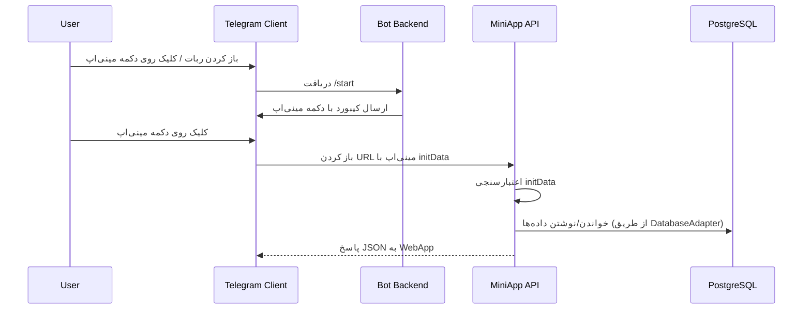

# یکپارچه‌سازی مینی‌اپ با ربات و Backend

این سند توضیح می‌دهد مینی‌اپ چگونه باید با ربات تلگرام، API و دیتابیس فعلی پروژه یکپارچه شود.

---

## ۱. نقطه ورود در ربات (Bot → Mini App)

### ۱.۱. محل مناسب برای دکمه مینی‌اپ

- فایل کلیدی: `handlers/user/modules/navigation/main_menu.py`
- کلاس: `MainMenuHandler`
- متد: `start`

در این متد، کیبورد اصلی کاربر ساخته می‌شود؛ بهترین جا برای اضافه کردن دکمه‌ی «📱 مینی‌اپ» همین‌جاست.

### ۱.۲. ایده‌ی پیاده‌سازی (نمونه مفهومی)

> توجه: این فقط نمونه مستند است و هنوز در کد پروژه اعمال نشده؛ اگر خواستید، می‌توان آن را دقیقاً در کد پیاده کرد.

۱. در بالای فایل، import لازم برای WebApp:

```python
from telegram import WebAppInfo, KeyboardButton
from config.config import MINIAPP_ENABLED, MINIAPP_URL
```

۲. در `MainMenuHandler.start`، بعد از ساخت `keyboard` اصلی:

```python
if MINIAPP_ENABLED and MINIAPP_URL:
    miniapp_button = KeyboardButton(
        text=kb("menu.buttons.miniapp", lang),
        web_app=WebAppInfo(url=MINIAPP_URL)
    )
    keyboard.append([miniapp_button])
```

۳. بقیه منطق تابع بدون تغییر باقی می‌ماند.

> در صورت تمایل می‌توان به جای Reply Keyboard از Inline Keyboard همراه با `InlineKeyboardButton(web_app=WebAppInfo(...))` استفاده کرد.

---

## ۲. جریان داده Mini App → API → DB

### ۲.۱. نمای کلی



- در بسیاری از معماری‌ها، BOT و API می‌توانند در یک پروسه باشند؛ مهم این است که:
  - لایه API از همان `DatabaseAdapter` و `AttachmentAnalytics` استفاده کند.

---

## ۳. اتصال API به زیرساخت فعلی

### ۳.۱. دسترسی به دیتابیس

در ماژول API (مثلاً `miniapp_api.py`)، برای دسترسی به DB باید از `DatabaseAdapter` استفاده شود:

```python
from core.database.database_adapter import get_database_adapter
from utils.attachment_analytics import AttachmentAnalytics

_db = get_database_adapter()
_analytics = AttachmentAnalytics(_db)
``

- تمام handlerهای HTTP (مثلاً در FastAPI/Flask) از `_db` و `_analytics` استفاده می‌کنند.
- به‌این‌ترتیب، منطق داده و آنالیتیکس با ربات یکسان خواهد بود.

### ۳.۲. نمونه‌ی انتزاعی یک endpoint (مثال مفهومی)

```python
@app.get("/miniapp/v1/attachments")
def get_attachments(category: str, weapon: str, mode: str = "br"):
    # 1. اعتبارسنجی پارامترها (category, mode)
    # 2. فراخوانی متدهای DB
    top_items = _db.get_top_attachments(category, weapon, mode)
    all_items = _db.get_all_attachments(category, weapon, mode)
    season_items = _db.get_season_top_attachments_for_weapon(category, weapon, mode)
    # 3. نگاشت به ساختار خروجی API (مطابق API_SPEC.md)
    return {"ok": True, "result": {...}}
```

> این کد فقط برای توضیح جریان داده است و در ریپو فعلی وجود ندارد.

---

## ۴. هم‌راستایی i18n بین ربات و مینی‌اپ

- ربات از `locales/fa.json` و `locales/en.json` و تابع‌های `t` و `kb` برای ترجمه استفاده می‌کند.
- مینی‌اپ می‌تواند یکی از دو رویکرد را اتخاذ کند:

1. **ترجمه سمت Frontend**
   - بسته‌ی ترجمه (JSON) را در Frontend نگه دارد و فقط keyها را از API بگیرد.

2. **ترجمه سمت Backend**
   - API متن ترجمه‌شده را برگرداند (مثلاً نام دسته‌ها/مودها).

پیشنهاد در این پروژه:

- برای داده‌های «دامین» (مانند نام سلاح و اتچمنت) از همان مقادیر دیتابیس استفاده شود (اغلب انگلیسی).
- برای label های UI، Frontend ترجمه‌های خودش را داشته باشد تا از تغییرات مستقل باشد.

---

## ۵. هماهنگی با حالت Webhook

اگر براساس `docs/NEW_FEATURES_IMPLEMENTATION.md`، ربات به حالت Webhook مهاجرت کند:

- می‌توان ربات و API مینی‌اپ را روی یک وب‌سرور واحد اجرا کرد.
- نمونه طرح:
  - `https://your-domain.com/telegram/webhook` → Webhook ربات.
  - `https://your-domain.com/miniapp/v1/...` → API مینی‌اپ.

این هم‌مکانی باعث ساده‌تر شدن تنظیمات BotFather و امنیت (یک دامنه‌ی واحد) می‌شود.

---

## ۶. تست و مانیتورینگ یکپارچه

- برای اطمینان از سلامت کل زنجیره:
  - E2E Tests طبق `TESTING_VALIDATION.md` اجرا شوند.
  - لاگ‌های ربات و API در یک سیستم مرکزی نگه‌داری شوند.

- در صورت اضافه کردن ابزارهایی مانند Sentry یا Prometheus:
  - خطاها و متریک‌های مینی‌اپ نیز باید در همان داشبوردها نمایش داده شوند.

---

## ۷. جمع‌بندی

- دکمه‌ی مینی‌اپ در منوی اصلی ربات نقطه‌ی ورود کاربر است.
- API مینی‌اپ باید روی همان زیرساخت DB/Analytics ربات سوار شود.
- این سند خطوط اصلی یکپارچه‌سازی را مشخص می‌کند؛ جزئیات دقیق‌تر در `ARCHITECTURE.md`, `IMPLEMENTATION.md` و `API_SPEC.md` آمده است.
